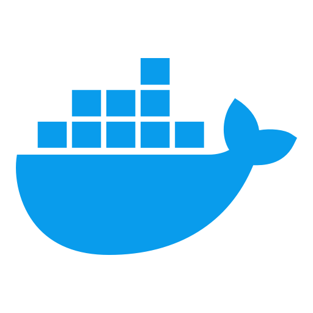

# Dockerize

<div style="display:flex; justify-content: center; align-items: center; max-width: 600px; margin: 0 auto; ">

  

</div>

Thanks a lot to _Farhan Hasin_ for a great tutorial on how to use Docker. [Give a 🌟](https://github.com/fhsinchy/docker-handbook-projects)

About how to get started with _Docker_ and how you get a solid fundamental base with docker commands and scripts. 🐳

Using images from _Docker hub_ and created containers.

Writing your own images , for example a basic Node express application.

### List docker containers and images

```bash

  docker ps -a

```

### getting Redis image from Dockerhub

```bash
  docker run redis
```

Too keep the server running we need to run the Redis image in a detach mode with the _--detach_ flag or with a shortcut of _-d_

You should be able to inspect your dashboard with the **ps** command.

```bash
  docker ps -a

```

<br/>

### Remove all images

```bash
  docker images purge
```

<br/>

### executing other commands inside a already running container with _EXEC_

```bash

docker exec <container id> <command>

```

For example

```bash
  docker exec -it 5531133af6a1 redis-cli
```

<br/>

### Starting Shell Inside a Active Container

If you want to use the shell in a running container then you can use almost the same command as previous, end the script with sh

```bash
docker run exec -it <container id> sh
docker run exec -it 7860bdfs21ds sh

```

To just see the logs in our terminal for a running container we run

```bash
  docker logs <container id>
  docker logs bgh452221Fde21
```

<br />

### To stop a running container (Kill)

We can write a simple command like

```bash
  docker stop <container id>
  docker stop fr423ds3132
```

Another command is to simple run

```bash
  docker kill <container id>
  docker kill fr423ds3132
```

<br/>

### Mapping over different ports

We can simple and really easy to run a simple web server like [**Nginx**](https://www.nginx.com/).
We will pull the image from docker hub and create a container from it.

```bash
  docker run nginx
```

to make nginx keep running we need to add the _--detach_ flag , or _-d_.
Nginx run by default on port : 80 , to have access to the port on our local development environment we need to tell our machine to run the port in our environment and not just in the container.

So we need to map port in our container to run in our own local environment.
simple commands like _--port_ ore _-p_ should do the job.

```bash
  docker run -p <host port:container port> nginx
  docker run -p 80:80 nginx
```

This will run nginx on our local machine on port 80 now 🙌⚛️

<br/>

### Build own image ≒🏗

To create your own image you will need a **Dockerfile**, here you will put all your building steps.
You always start your **Dockerfile** with _FROM_.
This instruction starts a new build stage and sets the base image.
So for example.

```Dockerfile
  FROM ubuntu
```

will set ubuntu as our base image, we want all the functionality from the Ubuntu image that already exits in Docker hub.

**apt-get** is Ubuntu own package-manager.
_RUN_ is a another step that will run in our image.
_CMD_ provide defaults for an executing container, can only be one _CMD_ command inside a Dockerfile.

```Dockerfile
RUN apt-get update
RUN apt-get install nodejs -y

CMD ["node"]
```

To build the image tou enter the docker build command.

```bash
  docker build <build context>
```

<br/>

### Build a Node server

#### Dockerfile instructions should be:

- use a base image that allows you to run _Node_ applications.
- copy **package.json** file and install the dependencies by running npm/yarn run install
- Copy all the project files that we needs.
- start the application by running the script _npm/yarn run start_

```Dockerfile
FROM node

WORKDIR /usr/app

COPY ./package.json ./
RUN npm install

COPY . .

CMD ["npm","run","start"]

```

To run the app and on our local environment we need to map the port from the container.

```bash
  docker run -p 3000:3000 df32432fd32d
```

<br/>

### Volumes

Working with volumes comes in very handy when you want your container to be able to access the files from your host, for example your code.

For example when you building a React image and you will change the code while running the app, you will not see any changes because the container will not change the copy of the image.

Thats why volumes are useful.

Docker has an syntax -v or --volume for the run command.

```bash
  docker run -v
  -v or --volume

  docker run -v <absolute path to host directory>:<absolute path to container working directory> <image id>

  docker run -v /Users/masiuciszek/web-dev/my_web_proj/docker_ized/react:/usr/app 32fd21213sdas23

```

This can actually can be improved with the _\$(pwd)_ variable
so instead of writing the whole path we can just add into out script the _\$(pwd)_ variable.

```bash
docker run -p 3000:3000 -v /usr/app/node_modules -v ${pwd}:/usr/app cc911238f2db
```

There are 2 kind's of _volumes_

**Named Volumes:** These volumes have a specific source from outside the container, for example -v (\$PWD):/usr/app.

**Anonymous Volumes:** These volumes have no specific source, for example -v /usr/app/node_modules. When the container is deleted, anonymous volumes need to be deleted manually.

<br/>

### Multi-staged Builds
